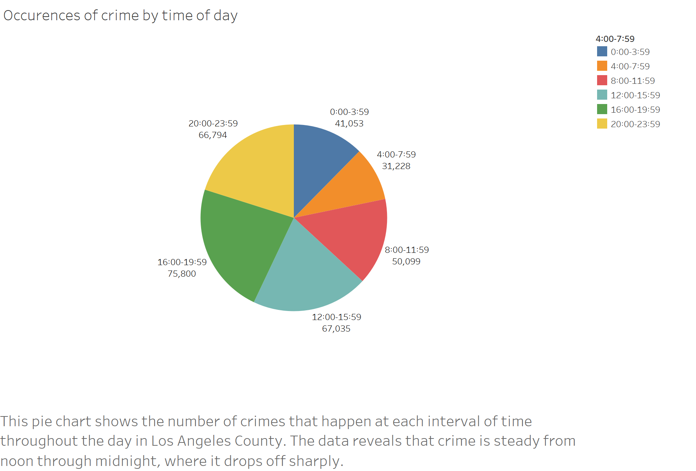

## Introduction

This data had a lot of interesting information, but the most interesting things that I learned were surrounding the time of day of crime and crime victim demographics. I hyper-focused in on the most victimized demographic in the area of Los Angeles with the most crime, finding that Hispanic Men are significantly more likely to be the victim of a crime compared to any other demographic.

My supporting evidence is in the different demographic information that I was able to find on my way to closing in on the area and demographic I would look at. It helps to have the bigger picture to compare with the specific data.

## Dataset
This data set contains all relevant data regarding crimes in Los Angeles County from 2020 to the present.
It was collected by the Los Angeles Police Department in order to provide citizens with insight into the crime in the area and to add to a sense of public safety.
I was interested in this data set because Los Angeles county isn't too far from where I'm from so I have a personal interest.

[Crime data](https://data.lacity.org/Public-Safety/Crime-Data-from-2020-to-Present/2nrs-mtv8/about_data)

## Initial Questions

The first thing that drew me to this data set was the fact that it had a lot of different interesting columns that I could look into.
I was first curious about the time occurred column as well as the columns related to demographics like victim descent, victim sex, and victim age.

  My original three questions were
  
-  What Crimes are most common during different times of day?
-  Do certain Areas see an increase in crime during different time of the year?
-  What are the victim demographics?

The questions that I came up with while I was working with the data were mostly surrounding narrowing down my demogrphic examination in order to get an indepth view into how crime affects a specific people. Another interesting thing that I chose to look into was average report time for people of different descents/ethnicities.

Something that surprised me in the data was how the crime demographics changed from the overall Los Angeles county to when I looked at one specific area.

The data was very easy to work with, there were of course null values and some codes that needed to be figured out, but Tableau has features for dealing with that.

## Discoveries & Insights

First I looked at when crimes were occuring most.

Then I wanted to find out what were the most common crimes at each time.
 

Then I wanted to start finding demographic information, so I started with the big picture.

After that I wanted to find out how Gender factored in.

Seeing that People of Hispanic Descent are the most victimized, I looked into which age groups had the most victims.

Taking a step back, I decided to see which areas of Los Angeles had the most crime throughout the year.

Central Los Angeles had the most crime, so I wanted to know which crimes were most common.

Then I checked out the demographics of Central Los Angeles to see if they reflected the same as the county

Taking everything so far together, I looked to see when crimes were commited against people of Hispanic Descent in Central Los Angeles 

As an additional question, I wanted to check what the average report time for a crime was for people of different descents and how it stacked up against which people were commonly victimized.

## Conclusion

This Data has a lot of helpful information and is fantastic for learning the victim demographics in Los Angeles.
I found that the data shows that in the area with the most crime in Los Angeles the most victimized demographic is the Hispanics, which reflects the overall victim demographics.
What deos not reflect the overall demographics however, is the disparity between Hispanic men and women victims in Central Los Angeles.
The overall demographic is very close between the two, but in central Los Angeles, men are far more victimized compared to women.
This is actually true for all of central Los Angeles where it shows that women are victims far less often than men for poeple of all descents.
The last thing that I found is that the descent of people who take the longest to report crime on average are far from the most victimized and the ones that take the longest don't even crack the top ten for most victims.

## Sources

The site with the data had a lot of information that helped me decipher the codes that it had for victim descent and victim sex.
[Crime Data](https://data.lacity.org/Public-Safety/Crime-Data-from-2020-to-Present/2nrs-mtv8/about_data)
